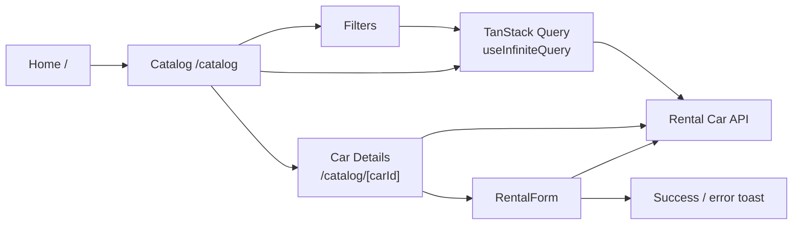

# RentalCar

Frontend for **RentalCar**, a car-rental application. Browse available vehicles, filter cars on the backend by brand, hourly price, and mileage, load more results, view details in a new tab, and submit a booking request.

Built with **Next.js 16 (App Router)**, **React 19**, and **TypeScript**, using the public [Rental Car API](https://car-rental-api.goit.study/api-docs/).

   

## Live demo

- **Production:** [rental-car-plum-three.vercel.app](https://rental-car-plum-three.vercel.app/)
- **Source code:** [github.com/Larimar4you/rental-car](https://github.com/Larimar4you/rental-car)
- **API documentation:** [Rental Car API](https://car-rental-api.goit.study/api-docs/)
- **Design:** [Rental Car on Figma](https://www.figma.com/design/A25LdVK3gZOPJaedrkTwWQ/Rental-Car)

## Architecture at a glance



The catalog uses a **Client Component** for filter controls and paginated queries. The individual car page retrieves car data in an **async Server Component**; the booking form is a Client Component. HTTP requests are centralized in `lib/api.ts`.

## Pages

| Route              | Purpose                                                                              |
| ------------------ | ------------------------------------------------------------------------------------ |
| `/`                | Hero section and **View Catalog** call to action                                     |
| `/catalog`         | Car list, backend filters, **Load More**, loading and empty states                   |
| `/catalog/[carId]` | Car image, information, specifications, rental conditions, features and booking form |

## Features

- **Backend filtering:** choose one brand and one maximum price; set minimum mileage, maximum mileage, or both. Click **Search** to apply the filters; **Clear filters** resets them.
- **Load More:** TanStack Query's `useInfiniteQuery` fetches additional pages using the active filters and appends cars to the list.
- **Car details:** **Read more** opens the selected vehicle in a new browser tab.
- **Booking request:** name, email and comment are validated; the form sends a request to the backend and displays success or error notifications using `react-hot-toast`.
- **UI states:** loading indicator, no-results state and feedback for invalid booking fields.

## Tech stack

| Area                         | Technology                                         |
| ---------------------------- | -------------------------------------------------- |
| Framework                    | Next.js 16, App Router; React 19                   |
| Language                     | TypeScript                                         |
| Data fetching and pagination | TanStack Query, `useInfiniteQuery`                 |
| HTTP                         | Native `fetch` in `lib/api.ts`                     |
| Styling                      | CSS Modules and design tokens in `app/globals.css` |
| Icons                        | React Icons and SVG assets                         |
| Notifications                | React Hot Toast                                    |
| Deployment                   | Vercel                                             |

## Getting started

**Requirements:** Node.js and npm.

```bash
git clone https://github.com/Larimar4you/rental-car.git
cd rental-car
npm install
npm run dev
```

Open [http://localhost:3000](http://localhost:3000).

### Production build

```bash
npm run build
npm run start
```

The current API base URL is configured in `lib/api.ts` as `https://car-rental-api.goit.study`. No environment variable is required for this API URL in the implementation described here.

## How to use

1. Open the home page and select **View Catalog**.
2. Choose a brand, a price, and/or a mileage range, then select **Search**.
3. Select **Load More** to append another page of results when available.
4. Select **Read more** to open a vehicle's details in a new tab.
5. Fill out the booking form and select **Send**. A notification displays the result.

## Project structure

```text
app/                       Next.js App Router pages and global styles
  catalog/[carId]/         Dynamic car details page
components/
  CarCard/                 Vehicle preview and Read more link
  CarDetails/              Full vehicle information
  CarList/                 Catalog cards
  Catalog/                 Catalog queries and pagination
  Filters/                 Filter controls
  Loader/                  Loading indicator
  NotFound/                Empty-results state
  RentalForm/              Validated booking form
lib/api.ts                 API requests for cars, filters and bookings
public/icons/              SVG icons for vehicle specifications
types/                     TypeScript types for cars and filters
```

## API integration

| Method | Endpoint                         | Use                                               |
| ------ | -------------------------------- | ------------------------------------------------- |
| GET    | `/cars`                          | Fetch paginated cars with filter query parameters |
| GET    | `/cars/filters`                  | Fetch available brands and price range            |
| GET    | `/cars/{id}`                     | Fetch details for one car                         |
| POST   | `/cars/{carId}/booking-requests` | Send booking data (`name`, `email`, `comment`)    |

See the [API documentation](https://car-rental-api.goit.study/api-docs/) for request and response schemas.

## Deployment

The application is deployed on [Vercel](https://rental-car-plum-three.vercel.app/).

## Author

**Lara Kosta** — [GitHub: Larimar4you](https://github.com/Larimar4you).
